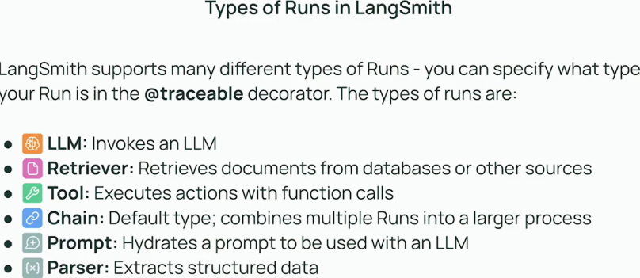
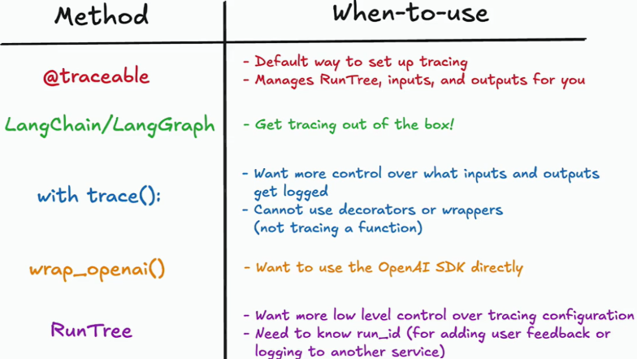

## **Module 1** 
### **Lesson 1 - tracing_basics**
- Decorate function with `@traceable` for LangSmith to trace.
- Send Metadata along in `@traceable` for additional information 
- Retrieval-Augmented Generation (RAG) is a technique in natural language processing (NLP) that combines a retrieval system with a generative model (like GPT-4) to produce more accurate, grounded, and up-to-date responses.

### **Lesson 2 - type_of_runs** 

### **Lesson 3 – alternative_tracing_methods**
